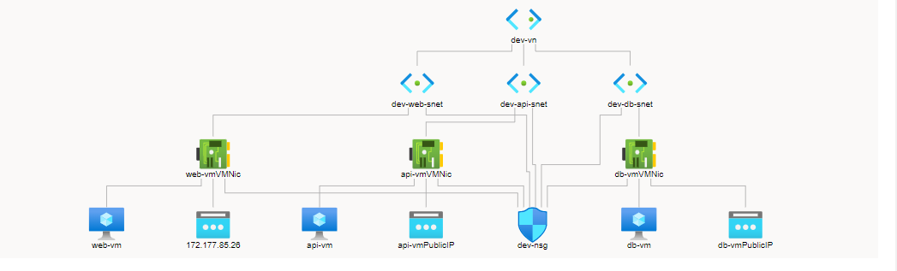

This azure-automation-scripts is a repository containing bash scripts for automating resource deployment and management in Microsoft Azure.

PROJECT CASE STUDY
Hators Corporation is a healthcare company that serves over 1 billion users worldwide with all employees working remotely. The company has requested the provisioning of Linux virtual machines in Azure for a 3-tier infrastructure setup (Web, API, and Database) to serve as a testing environment for the development team. The VMs needs to be deployed with all required components which include the networking and storage resources. 
Engineering Team Delivery:
The Knixat Cloud Engineering team has been tasked to deploy the virtual machine on Azure through the portal. All resources required for the virtual machine are currently non-existent and needs to be deployed. 
Your team is required to design and develop the solution. The deliverables should include the architecture of the environment and a demo for the deployed resources showcasing functionality and user documentation. To meet the network security requirement, ensure that the deployment only exposes required workload to the internet and block all unauthorized traffic to private resources.

PROCEDURE :

A.	Develop a network architecture.

B.	Create all necessary resources/group
	1.Resource Group: hator-dev-rg
	2.Virtual Network: dev-vn (10.0.0.0/16)
	3.Subnetworks: 
		a.web-snet (10.0.0.0/24)
		b.api-snet (10.0.1.0/24)
		c.db-snet (10.0.2.0/24)
	4.Public IP Address: dev-ip
	5.Network Security Group: dev-nsg
	6.Virtual Machines:
		a.web-vm
		b.api-vm
		c.db-vm
C.	Set security rules for all network connections
	Inbound Security Rules
	1.Allow port 80 over the internet to the Web Subnet (10.0.0.0/24).
	2.Deny port 80 from internet to API Subnet (10.0.1.0/24).
	3.Deny port 80 from internet to DB Subnet (10.0.2.0/24).
	4.Allow port 80 from Web Subnet to API Subnet.
	5.Allow port 80 API Subnet to DB Subnet.
	6.Deny port 80 from Web Subnet to DB Subnet.
	7.Allow port 22 from any to Web Subnet.
	8.Allow port 22 from Web Subnet to API Subnet.
	9.Allow port 22 from API Subnet to DB Subnet.
	10.Deny port 22 from Web Subnet to DB Subnet.
	Outbound Security Rules
	1.Allow port 80 from API Subnet to Web Subnet.
	2.Allow port 80 from DB Subnet to API Subnet.
	3.Deny port 80 from DB Subnet to Web Subnet.
D.	Configure the network security group to the security rules
E.	Test resources to ensure security compliance.

